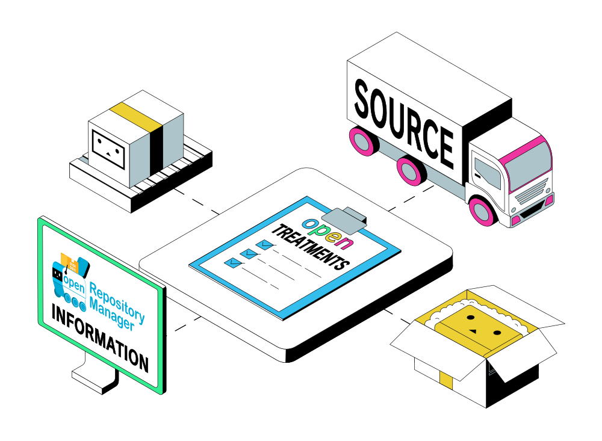

# Guidelines

The API usage guidelines are very simple.

1\) Significant API users should ideally provide a user agent, so that they can be identified in analytics and in case of a potential error.

2\) If an application serves as a client for Repository Manager repositories, or the Open Shop Channel repository, visible credit to Repository Manager, Open Shop Channel and dhtdht020 would be very very appreciated. It's difficult work! :smile:

3\) Have fun coding! =D

<figure><figcaption>
Repository Manager! So sophisticated!
</figcaption></figure>
