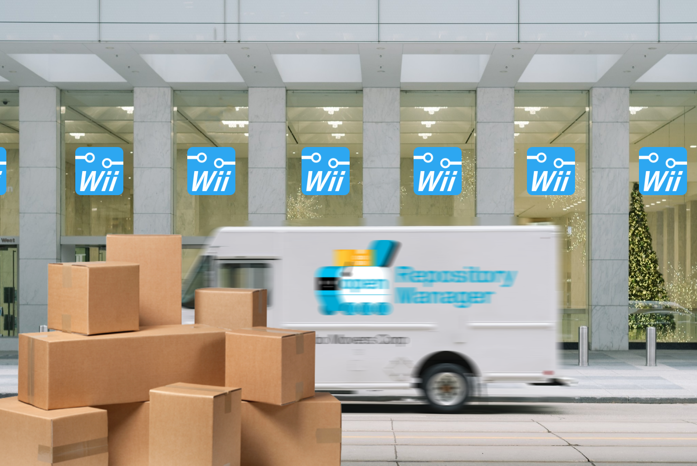

# Retrieving Contents


<figure><figcaption><p>Danbo's on the way with the apps!</p></figcaption></figure>

This endpoint returns all available applications. Specifically, successfully indexed applications.



Returns all apps available in the repository.







Example response:

```json
[
  {
    "author": "Fledge68",
    "category": "utilities",
    "description": {
      "long": "WiiFlow is a app for loading backup games from a USB Device or SD card.\n    It displays your games in a coverflow with 3D full box covers.\n    \n    Key features:\n    * Emulated NAND support\n    * Plugin system for emu apps\n    * Devolution support\n    * Nintendont support\n    * Neek2o support",
      "short": "USB Loader app"
    },
    "file_size": {
      "binary": 4619072,
      "icon": 8319,
      "zip_compressed": 3307321,
      "zip_uncompressed": 6073186
    },
    "name": "WiiFlow WFL",
    "package_type": "dol",
    "peripherals": [
      "Wii Remote",
      "Wii Remote",
      "Wii Remote",
      "Wii Remote",
      "Nunchuk",
      "Classic Controller",
      "GameCube Controller",
      "SDHC"
    ],
    "release_date": 1647993600,
    "slug": "wiiflow",
    "subdirectories": [
      "/apps/wiiflow/imgs",
      "/apps/wiiflow/bins"
    ],
    "url": {
      "icon": "http://hbb4.oscwii.org/api/v3/contents/wiiflow/icon.png",
      "zip": "http://hbb4.oscwii.org/api/v3/contents/wiiflow/wiiflow.zip"
    },
    "version": "5.5.3"
  },
  ...
]
```

At the root level, this response contains a list of app objects. Below is a definition for an app object as returned by the API in this endpoint.

<table data-full-width="true"><thead><tr><th width="217">Field</th><th width="412.3333333333333">Description</th><th>Type</th></tr></thead><tbody><tr><td>author</td><td>Author of the application, as specified in the meta.xml (fallback value: author field on manifest)</td><td>str</td></tr><tr><td>category</td><td>Name of category, as specified in the application manifest. Will always be a category declared as an available category in the <a href="retrieving-information.md">information endpoint</a> and the categories.json file in repository root.</td><td>str</td></tr><tr><td>description</td><td>Description of the application, as specified in meta.xml.<br><br>"short" (str): "short_description" in the meta.xml, this should be used in areas where the long description won't fit. Short description as specified by the application author or overridden by manifest.<br><br>"long" (str): "long_description" in the meta.xml. Long description as specified by the application author or overridden by manifest.</td><td>dict</td></tr><tr><td>file_size</td><td>Dictionary of various file sizes, all ints.</td><td>dict</td></tr><tr><td>flags</td><td>Dictionary of flags. <a href="../manifests/essential-information/flags.md">List of all supported flags</a>, all strings.</td><td>dict</td></tr><tr><td>name</td><td>The display name of the application, as specified in meta.xml (fallback value: name field on manifest)</td><td>str</td></tr><tr><td>package_type</td><td>One of three (str) values: "dol" / "elf" / "thm". This indicates the primary or the only binary for the application. "thm" is for homebrew channel theme. Themes are currently not supported by Repository Manager.</td><td>str</td></tr><tr><td>peripherals</td><td>Peripherals supported by the application, list of strings.<br>Can include up to 4 "Wii Remote", and one of each of the following:<br>"GameCube Controller"<br>"Nunchuk"<br>"Classic Controller"<br>"SDHC"<br>"USB Keyboard"<br>"Wii Zapper"</td><td>list</td></tr><tr><td>release_date</td><td>UNIX timestamp of the application's release date as specified in meta.xml.<br>Fallback: binary creation date.</td><td>int</td></tr><tr><td>slug</td><td>Application slug. Formerly known as "internal_name" or "hbbID". The application on the repository would be called &#x3C;slug>.oscmeta.</td><td>str</td></tr><tr><td>subdirectories</td><td>List of additional directories (str) to be created, updated, or backed up by the client. Relative paths. Used by Homebrew Browser.</td><td>list</td></tr><tr><td>url</td><td>Full URLs (str) for downloading the application ZIP or the application icon.</td><td>list</td></tr><tr><td>version</td><td>Version as specified in the meta.xml.</td><td>str</td></tr></tbody></table>
