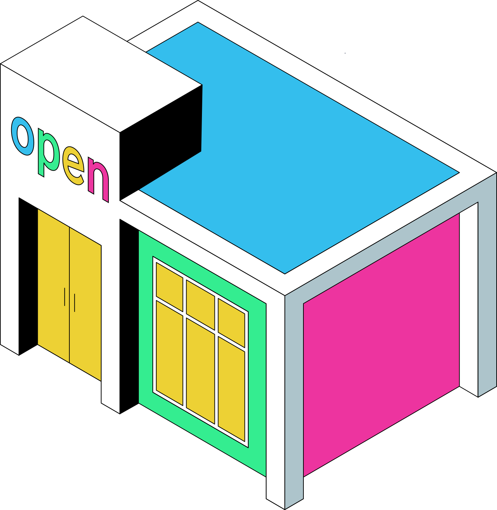

# Retrieving Information


<figure><figcaption><p>Welcome to my shop! The name's Open Shop Channel.</p></figcaption></figure>

If a client is written to support multiple repositories, it would be ideal if it could quickly receive general information about a given repository before connecting to it. This endpoint serves that purpose.



Returns general repository information such as its name, the amount of apps it provides, and the available categories.







Example response:

```json
{
  "available_apps_count": 143,
  "available_categories": [
    {
      "display_name": "Demos",
      "name": "demos",
      "plural": "demos",
      "singular": "demo"
    },
    {
      "display_name": "Emulators",
      "name": "emulators",
      "plural": "emulators",
      "singular": "emulator"
    },
    {
      "display_name": "Games",
      "name": "games",
      "plural": "games",
      "singular": "game"
    },
    {
      "display_name": "Media",
      "name": "media",
      "plural": "media applications",
      "singular": "media application"
    },
    {
      "display_name": "Utilities",
      "name": "utilities",
      "plural": "utilities",
      "singular": "utility"
    }
  ],
  "description": "Open Shop Channel's homebrew apps repository.",
  "git_url": "https://github.com/OpenShopChannel/Apps.git",
  "name": "Homebrew Apps",
  "provider": "Open Shop Channel"
}
```

On the root level of the JSON response, the following fields are available:

<table data-full-width="true"><thead><tr><th width="217">Field</th><th width="412.3333333333333">Description</th><th>Type</th></tr></thead><tbody><tr><td>available_apps_count</td><td>Amount of available applications. This number refers to successfuly indexed applications, and not the total amount of installed manifests.</td><td>str</td></tr><tr><td>available_categories</td><td>A dictionary containing category objects, each includes multiple fields of type str: a display name, the name of the category (as should be specified in manifests), and singular/plural variations, which can be used for sentences like "5 utilities available" "Download utility"</td><td>dict</td></tr><tr><td>description</td><td>The description of the repository, as defined in the repository.json file in repository root.</td><td>str</td></tr><tr><td>git_url</td><td>The source repository of the Repository Manager instance.</td><td>str</td></tr><tr><td>name</td><td>The display name of the repository, as defined in the repository.json file in repository root.</td><td>str</td></tr><tr><td>provider</td><td>The provider of the repository, as defined in the repository.json file in repository root.</td><td>str</td></tr></tbody></table>
