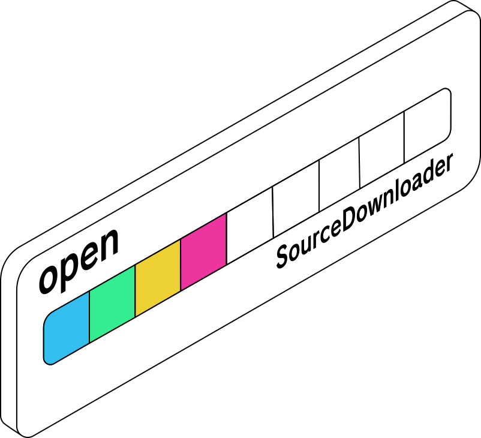

# SourceDownloader


<figure><figcaption><p>Downloading...</p></figcaption></figure>

Apps can be distributed on various different services, websites, and other potential sources. RepositoryManager is designed to support an infinite amount of them. How does it do it?

A "SourceDownloader" is a simple Python file containing instructions for how to obtain an application from a given source, implementing an abstract class "BaseSourceDownloader".\
SourceDownloaders are stored in the "sources" directory, located in the server root, and are by all means actual source code that runs on the server, so be careful with them.

All SourceDownloaders contained in the "sources" directory are "installed sources" and imported by the server during repository indexing.

The following is an example of a SourceDownloader:


```python
from sources.base_source_downloader import BaseSourceDownloader


class SourceDownloader(BaseSourceDownloader):
    name = "Mysterious Source Downloader"
    description = "Downloads a bunch of stuff from somewhere!!"
    
    def __init__(self, oscmeta, temp_dir, log):
        super().__init__(oscmeta, temp_dir, log)
        # new fields should be defined here
        # self.field_name = None

    def fetch_source_information(self):
        # Fetch source information for this source type
        # AKA, set the newly created fields
        pass

    def process_files(self):
        # Process files for this source type (it is mandatory to output an archive to self.archive_path)
        # AKA, make use of the newly created fields
        pass
```

